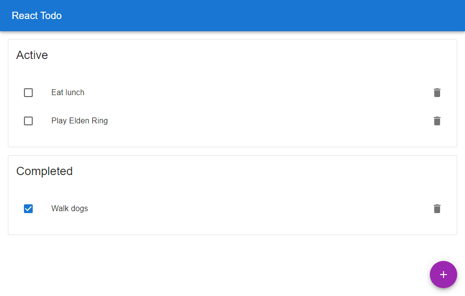

    

<h1 align="center">
  React Todo
</h1>

This is a simple React application that I built to keep track of tasks.

## Screenshot

## Technologies Used
- [React](https://reactjs.org/)
- [Create React App](https://create-react-app.dev/)
- [TypeScript](https://www.typescriptlang.org/)
- [Material-UI](https://mui.com/)